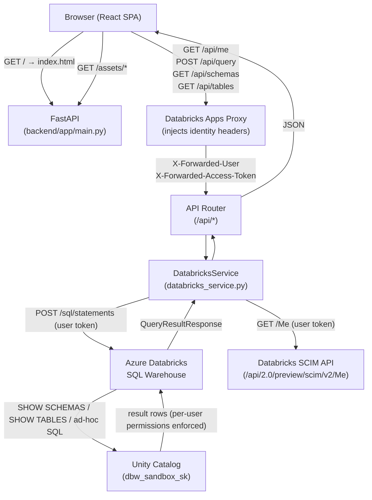

# Architecture

## Overview

A monorepo Databricks App consisting of a React/TypeScript SPA served by a Python/FastAPI backend. The backend executes SQL against an Azure Databricks SQL Warehouse and returns results to the frontend over a REST API.

The app is deployed on the **Databricks Apps** platform, which handles hosting, TLS, and OAuth M2M credential injection.

---

## Repository Structure

```
databricks-sandbox-2/
├── app.yaml                  # Databricks Apps entry point
├── requirements.txt          # Runtime deps (Databricks Apps reads from repo root)
├── frontend/
│   ├── src/
│   │   ├── api/              # Axios API client functions
│   │   ├── components/       # Shared UI components
│   │   ├── pages/            # Route-level page components
│   │   └── types/            # TypeScript interfaces mirroring backend models
│   └── dist/                 # Built output — committed and served by FastAPI
└── backend/
    ├── run.py                # Uvicorn entry point (referenced by app.yaml)
    └── app/
        ├── config.py         # Pydantic settings — reads env vars / .env
        ├── main.py           # FastAPI app, CORS, static file serving
        ├── models.py         # Pydantic response models
        ├── routers/
        │   └── databricks.py # /api/query, /api/schemas, /api/tables endpoints
        └── services/
            └── databricks_service.py  # SDK client + SQL execution logic
```

---

## Component Diagram



---

## Runtime Deployment

```
Databricks Apps platform
└── app.yaml  →  python backend/run.py
                 CWD: /app/python/source_code/
                 │
                 ├── uvicorn starts FastAPI on 0.0.0.0:8000
                 ├── frontend/dist/ is served as static files
                 └── auto-injected env vars:
                     DATABRICKS_HOST
                     DATABRICKS_CLIENT_ID       (OAuth M2M)
                     DATABRICKS_CLIENT_SECRET   (OAuth M2M)
```

**Critical:** `requirements.txt` must live at the **repo root** — the Databricks Apps runtime only reads from there, not from `backend/requirements.txt`.

---

## Authentication

| Context        | Mechanism                                       |
|----------------|-------------------------------------------------|
| Local dev      | `DATABRICKS_TOKEN` (PAT) in `backend/.env`      |
| Deployed app   | OAuth M2M via `DATABRICKS_CLIENT_ID` / `DATABRICKS_CLIENT_SECRET` auto-injected by the platform |

The Databricks Python SDK auto-detects credentials from environment variables using its built-in credential chain — no explicit auth code needed.

### User Authorization (per-user UC enforcement)

When **User Authorization** is enabled in the Databricks Apps UI settings, the platform injects two additional headers on every request:

- `X-Forwarded-User` — the internal Databricks user ID (e.g. `436568226980462@7405615634530034`)
- `X-Forwarded-Access-Token` — a short-lived OAuth token scoped to the signed-in user, including the `sql` scope

The backend passes the forwarded access token directly to the SQL Statements API (`POST /api/2.0/sql/statements`). This means every query executes as the end user — Unity Catalog enforces their `SELECT` / `USE SCHEMA` grants, not the service principal's.

**User identity resolution:** `X-Forwarded-User` is an opaque internal ID. The backend resolves it to a human-readable email by calling `GET /api/2.0/preview/scim/v2/Me` with the forwarded token. The result is cached in `_user_identity_cache` for the process lifetime.

**SP fallback:** If no forwarded token is present (local dev) or a 403 is returned, the service falls back to the service principal via the Databricks SDK. This fallback is transparent to the caller.

**Important:** The Databricks Python SDK cannot be initialized with `token=user_token` when `DATABRICKS_CLIENT_ID` / `DATABRICKS_CLIENT_SECRET` are also present in the environment — the SDK raises a credential-conflict error. All user-scoped HTTP calls therefore use the `requests` library directly instead of the SDK.

---

## Frontend → Backend Contract

All API calls use a relative base URL (`/api`) so they route through the same FastAPI process in both local dev (Vite proxy) and production (same-process serving).

| Endpoint              | Method | Purpose                                                    |
|-----------------------|--------|------------------------------------------------------------|
| `/api/me`             | GET    | Resolve current user email via SCIM /Me                    |
| `/api/query`          | POST   | Execute ad-hoc SQL under the signed-in user's identity     |
| `/api/schemas`        | GET    | List schemas in a catalog                                  |
| `/api/tables`         | GET    | List tables in a catalog.schema                            |
| `/health`             | GET    | Liveness check                                             |

---

## Key Configuration

All settings live in `backend/app/config.py` as a Pydantic `BaseSettings` model.

| Setting                    | Default          | Source                        |
|----------------------------|------------------|-------------------------------|
| `databricks_host`          | `''`             | Env / `.env`                  |
| `databricks_token`         | `''`             | Env / `.env` (local dev only) |
| `databricks_warehouse_id`  | `5288ab7cd99c4e09` | Hardcoded default (App resource injection unreliable) |
| `databricks_catalog`       | `dbw_sandbox_sk` | Hardcoded default             |
| `api_host`                 | `0.0.0.0`        | Env                           |
| `api_port`                 | `8000`           | Env                           |

`DATABRICKS_CLIENT_ID` and `DATABRICKS_CLIENT_SECRET` are consumed directly by the Databricks SDK from the environment and are not declared on the `Settings` model.
