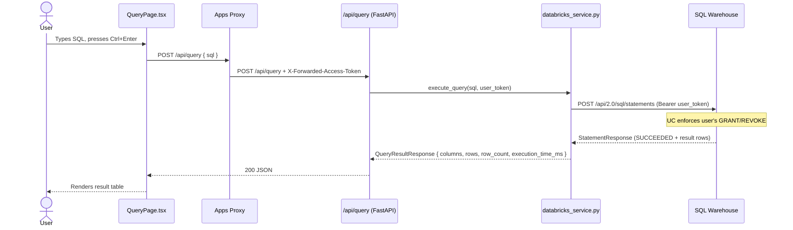
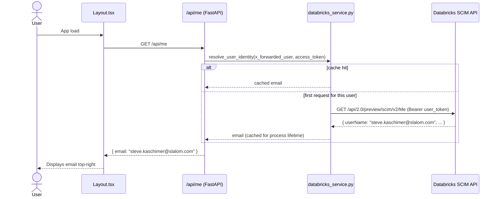
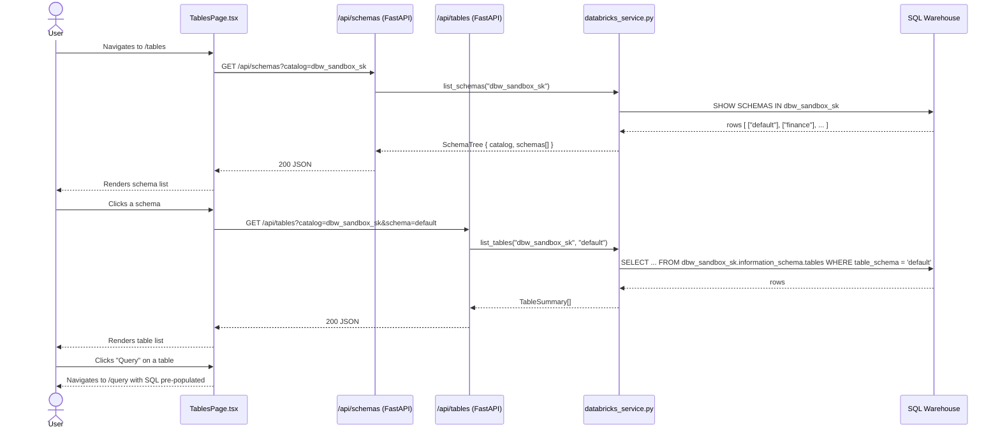
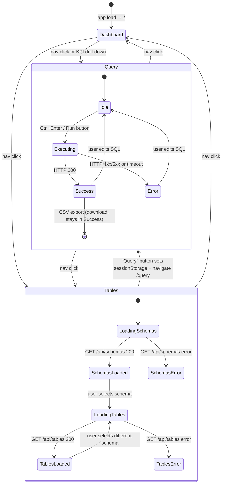
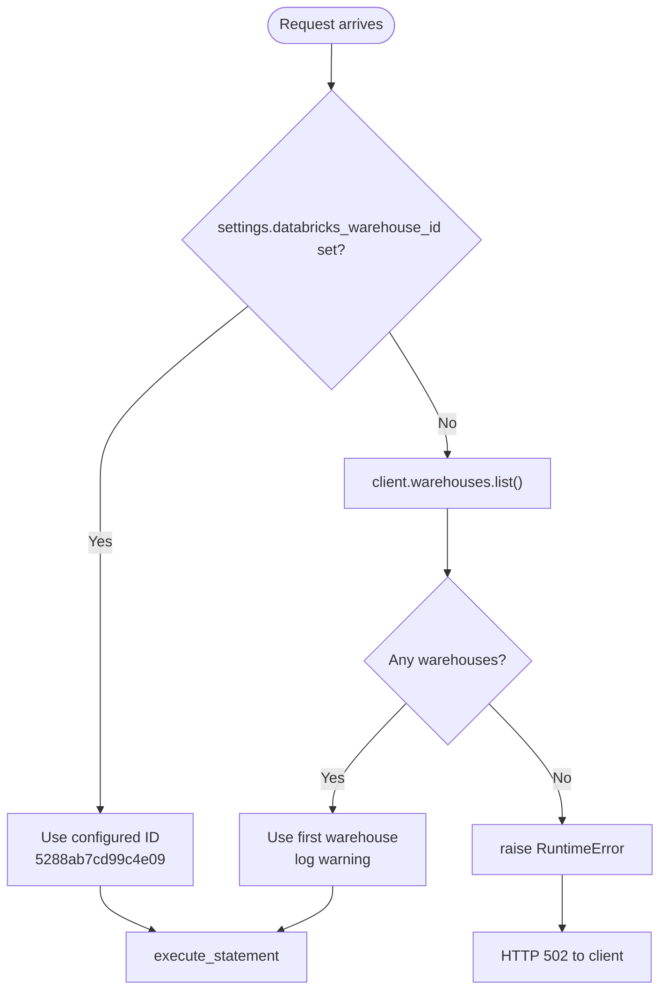

# Sequence & State Diagrams

## Query Execution Sequence

End-to-end flow when a user runs SQL from the Query page. Databricks Apps injects `X-Forwarded-Access-Token` on every request when User Authorization is enabled.

---

## User Identity Resolution Sequence

How the app resolves `X-Forwarded-User` (an opaque internal ID) to a human-readable email, displayed in the header.

---

## Schema Browser Sequence

Flow when a user opens the Tables page and clicks a schema.

---

## SPA Routing State Diagram

How the React app routes between pages and what state transitions each page manages.

---

## Warehouse ID Resolution Flow

How the backend resolves which SQL Warehouse to use at startup.

