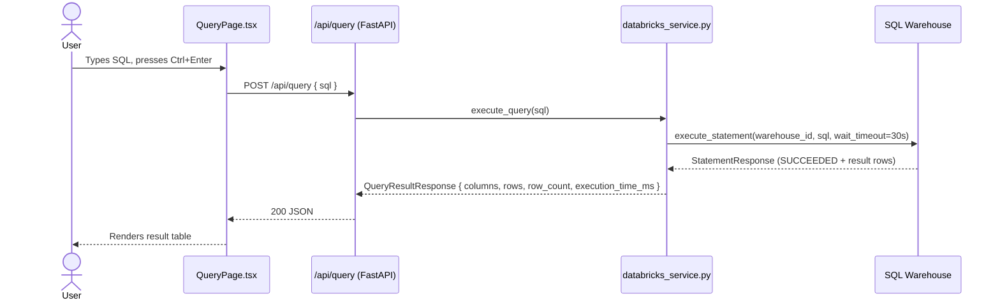
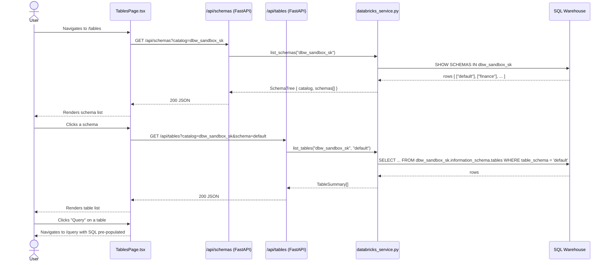
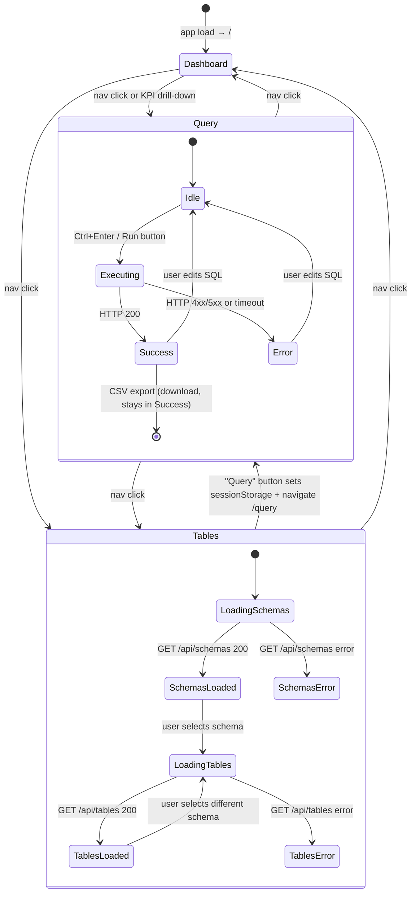

# Sequence & State Diagrams

## Query Execution Sequence

End-to-end flow when a user runs SQL from the Query page.



---

## Schema Browser Sequence

Flow when a user opens the Tables page and clicks a schema.



---

## SPA Routing State Diagram

How the React app routes between pages and what state transitions each page manages.



---

## Warehouse ID Resolution Flow

How the backend resolves which SQL Warehouse to use at startup.

```mermaid
flowchart TD
    Start([Request arrives]) --> Check{settings.databricks_warehouse_id set?}
    Check -- Yes --> UseConfigured[Use configured ID\n5288ab7cd99c4e09]
    Check -- No --> List[client.warehouses.list()]
    List --> Any{Any warehouses?}
    Any -- Yes --> UseFirst[Use first warehouse\nlog warning]
    Any -- No --> Raise[raise RuntimeError]
    UseConfigured --> Execute[execute_statement]
    UseFirst --> Execute
    Raise --> HTTP502[HTTP 502 to client]
```
